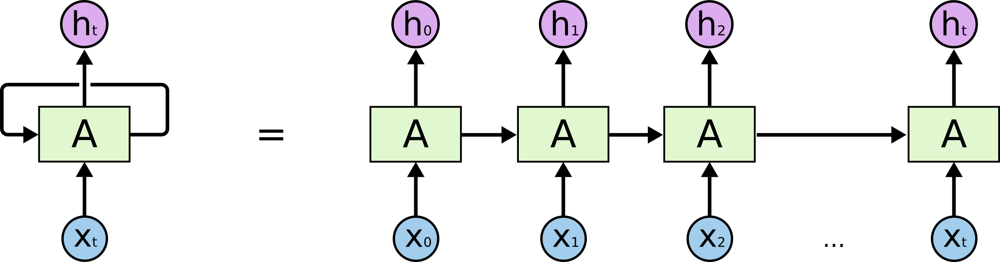
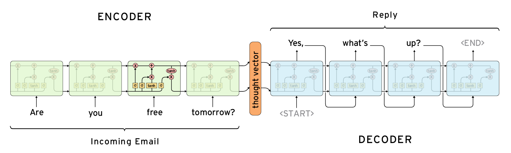

# Formula
* $h_t = \sigma (W_h x_t + U_h h_{t-1} + b_h)$
    * Params:
        * $h_t$: RNN 在第 $t$ 個時間點的輸出
        * $x_t$ : RNN 在第 $t$ 個時間點的輸入
        * $h_{t−1}$: RNN 在第 $t−1$ 個時間點的輸出
        * $W_h, U_h, b_h$: RNN 的參數，模型要訓練的目標
        * $\sigma$: 神經元的激活函數 (activation function)
    * $W_h$ 控制當前時間點的輸入 $x_t$ 如何影響當前時間點的輸出 $h_t$
    * $U_h$ 控制前一個時間點的輸出 $h_{t−1}$ 如何影響對當前時間點的輸出 $h_t$
    * 透過反覆迭代，訓練出最終的 $h_n$
     
     

    

    * RNN 使用上的侷限性：無法 output 比 input 還長的句子

* Sequence-to-sequence 的誕生就是來解決這個問題

    * 由 encoder, decoder 兩個 RNN 所構成，運作原理與人類的思維相似，當我們看到一段話時，會先將這句話理解吸收，再根據我們理解的內容說出回覆，Sequence to Sequence 就是在模擬這個過程。
    * Encoder 負責將輸入序列消化、吸收成一個向量，稱為 context vector，這個向量會囊括元序列的重要訊息
    * Decoder 則是根據 context vector 來生成文字，且為了解決多輸出的問題，seq2seq會將目前的輸出視為未來的輸入
    <pre><code>while output != 'EOS':     // End of Sentence
        output = decoder(output)
        outputs.append(output)
    </code></pre>
    * 對於輸入序列 $x_1, ..., x_T$ 與輸出序列 $y_1, ..., y_{T'}$ 而言，透過 Encoder 我們能將 $x_1, ..., x_T$ 轉換成 context vector $\nu$，我們希望能在 Decode 階段最大化條件機率 $p$:
    $$p(y_1, ..., y_{T'}|x_1, ..., x_T) = \prod_{t=1}^{T'} p(y_t|\nu, y_1, ..., y_{t-1})$$
    整個方程式的意涵是模型知道已經聽了甚麼 (context vector, $\nu$) 以及之前說過的內容 ($y_1, ..., y_{t-1}$)，並以這兩件事情維基準來評估現在該說的內容 ($y_T$)
     
    總歸而言， Sequence to Sequence 的精華所在便是串接了兩個 RNN ，第一個 RNN 負責將長度為 `M` 的序列給壓成 `1` 個向量，第二個 RNN 則根據這 `1` 個向量產生出 `N` 個輸出，這 `M -> 1` 與 `1 -> N` 相輔相成下就構建出了 `M to N` 的模型，能夠處理任何不定長的輸入與輸出序列，好比說：